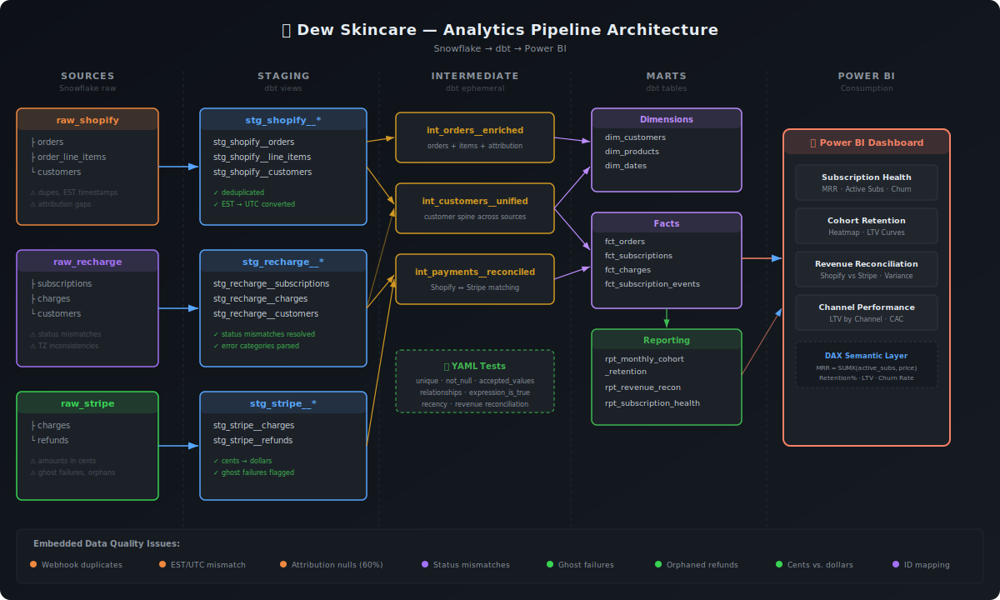

# 🧴 Dew Skincare — Subscription Analytics Pipeline

A production-grade analytics engineering project for a fictional DTC skincare subscription brand. Built with **Snowflake**, **dbt**, and **Power BI** to demonstrate end-to-end analytics infrastructure: from messy multi-platform source data to governed, decision-ready reporting.

---

## Why This Project Exists

In DTC subscription businesses, data lives across multiple platforms — Shopify for orders, Recharge for subscriptions, Stripe for payments — and they never perfectly agree. Revenue totals differ. Timestamps use different timezones. Webhook retries create duplicates. Attribution breaks on repeat orders.

This project models the real-world challenge of reconciling these sources into a single, trusted analytics layer. It's the same infrastructure I built professionally to drive 19% revenue growth for a major DTC subscription brand.

---

## Architecture



---

## Data Sources

| Source | Platform | What It Contains | Known Issues |
|--------|----------|------------------|--------------|
| `raw_shopify` | Shopify | Orders, line items, customers | Duplicate orders from webhook retries; EST timestamps |
| `raw_recharge` | Recharge | Subscriptions, charges, customers | UTC timestamps; status mismatches (active + cancelled_at) |
| `raw_stripe` | Stripe | Payment charges, refunds | Ghost failures with no Recharge record; orphaned refunds |

### Intentional Data Quality Issues

These are not bugs — they're realistic problems that exist in real DTC data environments:

1. **Duplicate orders** (~2% of Shopify orders) from webhook retry logic
2. **Timezone inconsistencies** — Shopify stores EST, Recharge/Stripe store UTC
3. **Orphaned refunds** — Stripe refund exists but Shopify financial_status wasn't updated
4. **Ghost payment failures** — Stripe declines with no corresponding Recharge charge record
5. **Subscription status mismatches** — Recharge shows "active" but has a `cancelled_at` date
6. **Attribution gaps** — ~60% of repeat subscription orders have null UTM parameters

---

## Project Structure

```
dew-subscription-analytics/
├── README.md
├── dbt_project.yml
├── packages.yml
├── seeds/                              # Synthetic source data (CSV)
│   ├── raw_shopify__customers.csv
│   ├── raw_shopify__orders.csv
│   ├── raw_shopify__order_line_items.csv
│   ├── raw_recharge__customers.csv
│   ├── raw_recharge__subscriptions.csv
│   ├── raw_recharge__charges.csv
│   ├── raw_stripe__charges.csv
│   └── raw_stripe__refunds.csv
├── models/
│   ├── staging/
│   │   ├── shopify/
│   │   │   ├── _shopify__sources.yml
│   │   │   ├── _shopify__models.yml
│   │   │   ├── stg_shopify__orders.sql
│   │   │   ├── stg_shopify__customers.sql
│   │   │   └── stg_shopify__order_line_items.sql
│   │   ├── recharge/
│   │   │   ├── _recharge__sources.yml
│   │   │   ├── _recharge__models.yml
│   │   │   ├── stg_recharge__subscriptions.sql
│   │   │   ├── stg_recharge__charges.sql
│   │   │   └── stg_recharge__customers.sql
│   │   └── stripe/
│   │       ├── _stripe__sources.yml
│   │       ├── _stripe__models.yml
│   │       ├── stg_stripe__charges.sql
│   │       └── stg_stripe__refunds.sql
│   ├── intermediate/
│   │   ├── _int__models.yml
│   │   ├── int_orders__enriched.sql          # Joins order + line items + attribution
│   │   ├── int_customers__unified.sql        # Customer spine across sources
│   │   └── int_payments__reconciled.sql      # Shopify ↔ Stripe payment matching
│   ├── marts/
│   │   ├── core/
│   │   │   ├── _core__models.yml
│   │   │   ├── dim_customers.sql
│   │   │   ├── dim_products.sql
│   │   │   ├── dim_dates.sql
│   │   │   ├── fct_orders.sql
│   │   │   ├── fct_subscriptions.sql
│   │   │   └── fct_charges.sql
│   │   └── reporting/
│   │       ├── _reporting__models.yml
│   │       ├── rpt_monthly_cohort_retention.sql
│   │       ├── rpt_revenue_reconciliation.sql
│   │       └── rpt_subscription_health.sql
│   └── utilities/
│       └── dim_dates.sql
├── tests/
│   └── generic/                        # Custom generic tests
├── macros/
│   ├── cents_to_dollars.sql
│   ├── generate_date_spine.sql
│   └── safe_divide.sql
├── analyses/
│   └── data_quality_audit.sql          # Ad-hoc quality checks
└── scripts/
    └── generate_synthetic_data.py      # Data generator (this repo)
```

---

## Model Descriptions

### Staging Layer
Clean, rename, type-cast, and deduplicate each source independently. No cross-source joins.

| Model | Key Transformations |
|-------|-------------------|
| `stg_shopify__orders` | Deduplicate webhook retries (ROW_NUMBER by order_id), convert EST→UTC, cast prices to numeric, parse UTM from landing_site |
| `stg_shopify__customers` | Standardize email (lowercase/trim), cast types |
| `stg_shopify__order_line_items` | Cast prices, calculate line-level net revenue |
| `stg_recharge__subscriptions` | Resolve status mismatches (cancelled_at + active = cancelled), standardize intervals |
| `stg_recharge__charges` | Flag failed vs. successful, parse error categories |
| `stg_recharge__customers` | Standardize email, join key to Shopify customer_id |
| `stg_stripe__charges` | Convert cents→dollars, standardize status, extract metadata fields |
| `stg_stripe__refunds` | Convert cents→dollars, join to charge records |

### Intermediate Layer
Cross-source joins and business logic that isn't yet at mart grain.

| Model | What It Does |
|-------|-------------|
| `int_orders__enriched` | Joins orders + line items + parsed attribution; calculates order-level metrics |
| `int_customers__unified` | Creates customer spine from Shopify + Recharge; resolves ID mapping |
| `int_payments__reconciled` | Matches Shopify orders to Stripe charges; flags discrepancies |

### Marts Layer — Core
Governed fact and dimension tables, ready for BI consumption.

| Model | Grain | Key Metrics |
|-------|-------|-------------|
| `dim_customers` | One row per customer | first_order_date, acquisition_channel, customer_type (subscriber/one-time), lifetime_orders, lifetime_revenue, current_subscription_status |
| `dim_products` | One row per product/variant | product_title, variant, sku, price, supply_duration_days |
| `dim_dates` | One row per calendar date | Standard date spine with fiscal periods, day_of_week, is_weekend, month_name |
| `fct_orders` | One row per order | order_date_utc, customer_key, product_key, gross_revenue, net_revenue, discount_amount, is_subscription_order, acquisition_channel, order_sequence_number |
| `fct_subscriptions` | One row per subscription | customer_key, product_key, subscription_start, subscription_end, status, cancellation_reason, charge_interval_days, total_charges, total_revenue |
| `fct_charges` | One row per charge attempt | charge_date_utc, subscription_key, customer_key, amount, status (success/failed/declined), failure_reason, payment_method |

### Marts Layer — Reporting
Pre-aggregated models optimized for Power BI. These are the semantic layer.

| Model | Purpose |
|-------|---------|
| `rpt_monthly_cohort_retention` | Month-over-month retention by acquisition cohort. Columns: cohort_month, months_since_first_order, customers_retained, retention_rate |
| `rpt_revenue_reconciliation` | Shopify revenue vs. Stripe settled revenue by month. Flags variance > 2% for investigation |
| `rpt_subscription_health` | Active subs, new subs, churned subs, MRR, payment failure rate, dunning recovery rate — by month |

---

## YAML Tests Strategy

Tests are where you prove you think about data quality, not just data.

### Source-Level Tests (in `_sources.yml`)
```yaml
# Every source table gets:
- unique (on primary key)
- not_null (on primary key)
- accepted_values where applicable (status fields)
```

### Model-Level Tests (in `_models.yml`)
```yaml
# Staging: validate cleanup worked
- unique: stg_shopify__orders.order_id  # Proves deduplication worked
- not_null: critical business fields

# Marts: validate business logic
- unique: dim_customers.customer_id
- relationships: fct_orders.customer_id → dim_customers.customer_id
- dbt_utils.expression_is_true:
    expression: "net_revenue >= 0"  # No negative revenue after reconciliation
- dbt_utils.recency:
    datepart: day
    field: order_date_utc
    interval: 3  # Data should be fresh within 3 days
```

### Custom Tests
```yaml
# Revenue reconciliation tolerance
- dbt_utils.expression_is_true:
    expression: "abs(shopify_revenue - stripe_settled_revenue) / nullif(shopify_revenue, 0) < 0.05"
    # Shopify and Stripe should agree within 5%
```

---

## Documentation

[Explore the interactive dbt docs →](https://absayi.github.io/dew-subscription-analytics/)

---

## Power BI Dashboard Design

### Page 1: Subscription Health Overview
- **MRR trend line** (with new vs. expansion vs. churned MRR stacked)
- **Active subscribers** count with month-over-month change
- **Payment failure rate** gauge
- **Churn rate** by month

### Page 2: Cohort Retention
- **Retention heatmap** — rows = acquisition month, columns = months since first order, cells = retention %
- **LTV curve by cohort** — line chart showing cumulative revenue by cohort over time
- **Filter by**: acquisition channel, product, subscription interval (30-day vs. 90-day)

### Page 3: Revenue & Reconciliation
- **Shopify vs. Stripe revenue** by month (dual-axis or side-by-side bars)
- **Variance flag** — highlight months where sources disagree by >2%
- **Refund rate** trend
- **Net revenue** after returns

### Page 4: Acquisition & Channel Performance
- **Customers by acquisition channel** (with first-order vs. repeat attribution)
- **LTV by channel** — which channels bring the highest-value subscribers?
- **Conversion to subscription** rate by channel

---

## Tech Stack

- **Snowflake** — Cloud data warehouse
- **dbt Core** — Data transformation and testing
- **Power BI** — Consumption and visualization layer
- **Python** — Synthetic data generation
- **GitHub** — Version control and documentation
